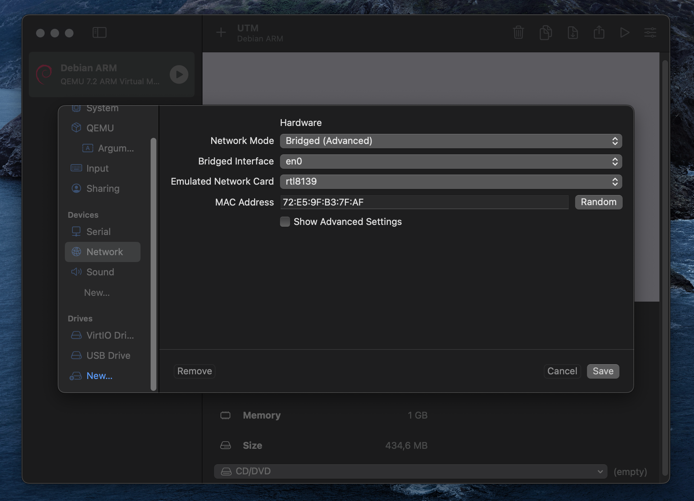
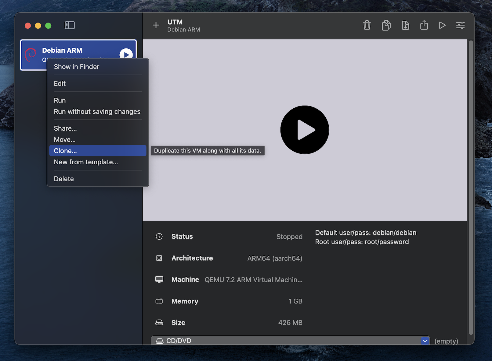

## Virtualization software choice

 - For Linux & Windows users, it's suggested to use Virtualbox.
   https://www.virtualbox.org/wiki/Downloads
 
 -  For Apple Silicon (ARM architecture), UTM seems to be the best free choice. In parallel, VMWare Player is also a good choice.
   https://www.virtualbox.org/wiki/Downloads

In this bootstrap, I'm going to use UTM as my virtualization solution.

For Debian's version, I suggest that we use Debian 10 for stability.
- UTM's page: https://mac.getutm.app/gallery/debian-10-4-minimal
- Debian's page: https://www.debian.org/releases/buster/debian-installer/

Note: Remeber to choose the right architecture. For Apple Silicon it's arm64 and for the rest it's amd64, unless you have a Windows ARM machine.

Note2: It's recommended to use a Virtual Machine (VM) without a desktop environment (GUI) such as GNOME, KDE, etc.


## 1. Creation of a Linux template
 
 **VM setup**
Knowing that we have a VM without graphic interface, we should choose a type of network. In this exercise, we will use the Bridged connection.




**Setup SSH connection**

To add SSH key to the VM, we need to:
1. Verify that you already have a ssh key on your machine:
   ```cd /home/$username/.ssh```
   
3. If you already have one, skip this step. To generate a key:
   ```ssh-keygen -t rsa```
   You should see a ```id_rsa.pub```file now.
   
4. Do a first SSH connection to your VM and create a ```.ssh``` folder:
   ```ssh Vm@vm mkdir -p .ssh```
   Vm@vm means your VM's hostname and your VM's ip.
   Example: debian@192.168.1.153
   Type in your VM password
   
5. From now on, you can do the ssh connection to your VM by doing
   ```ssh debian@192.168.1.153```
   
6. However, to do a connection using your ssh key, we need to copy the key into the VM by doing:
   ```cat .ssh/id_rsa.pub | ssh Vm@vm 'cat >> .ssh/authorized_keys```

7. From now on, you can log into your VM without using a password


**Do a clone of this version to avoid redo the whole set up in case error**

In Virtualbox, you can setup a snapshot instead of create a new VM in this case of UTM.



